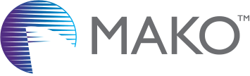

# Mako Sample Projects

Here you can find all the sample code that is referenced in the [Mako General Documentation](https://documentation.globalgraphics.com/mako/mako-core), plus more public sample code made using the Mako SDK.

## Mako Supported languages

Mako is developed in C++, for many the first choice of language for developing with Mako. Support for C#, Java, and Python is provided by [SWIG](http://swig.org), a software development tool that connects programs written in C++ with a variety of high-level programming languages. The same Mako classes and methods are available, although the syntax is modified to suit the target language.

## Visual Studio Projects

In this repository you can find C++ and C# projects in the **Visual Studio Projects** folder. Each Visual Studio solution has a `.vcxproj` and a `.csproj` file, as well as all the necessary `.cpp`, `.h` and `.cs` files. Input and output files are *not* included. C++ projects are mostly generally configured to use the `OutDir` as the working directory.

## Java and Python Projects

Java and Python versions of most sample code are also available in the respective **Java Projects** and **Python Projects** directories. These simply contain the `.py` and `.java` files for you to use in your IDE of choice.

## TestFiles

Many of the projects in this repository refer to a `TestFiles` folder, generally at the solution level, where input files are stored. This folder is not included and you will need to create one, or alternatively, remove references to this folder if you do not wish to use it.
